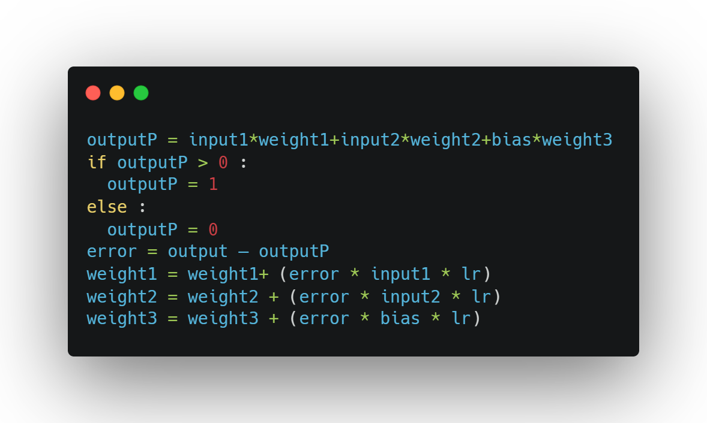

<div dir="rtl">

# جلسه اول: الگوریتم

  ## لینک‌های مفید

  </div>

  - [What is computational thinking?](https://www.computationalthinking.org/)
  - [Why I’m not moving to from VSCode to VSCodium](https://www.youtube.com/watch?v=Yf8O5c94KtY)
  - [Why is it called Python?](https://docs.python.org/3/faq/general.html#do-i-have-to-like-monty-python-s-flying-circus)
  - [Monty Python's Life of Brian](https://www.imdb.com/title/tt0079470/)

<div dir="rtl">

  ## تمرین
  1. الگوریتمی بنویسید که دو مقدار از ورودی خوانده و مقدار بزرگتر را چاپ کند
  2. الگوریتمی بنویسید که دو عدد از ورودی بخواند و اگر عدد اول زوج بود، جمع آنها و اگر عدد اول فرد بود، ضرب آن دو عدد چاپ شود.
  3. سه عدد از ورودی بگیرید و برمبنای عدد اول تصمیم بگیرید:
  - اگر باقیمانده تقسیم عدد اول بر عدد 3 برابر صفر بود: جمع همه چاپ شود.
  - اگر باقیمانده تقسیم عدد اول بر عدد 3 برابر یک بود: ضرب همه چاپ شود.
  - اگر باقیمانده تقسیم عدد اول بر عدد 3 برابر دو بود: جمع اولی و دومی منهای سومی چاپ شود.

  4. الگوریتمی بنویسید که دو عدد از ورودی بگیرد و تفریق اعداد بین آن دو را چاپ کند.
  5. الگوریتمی بنویسید که  یک عدد مثبت را دریافت کند و تعداد ارقام آن را چاپ کند.
  6. الگوریتمی بنویسید که از ورودی طول و عرض مستطیلی دریافت کند و محیط و مساحت آن را چاپ کند.
  7. الگوریتمی بنویسید که یک عدد دریافت کند و قدرمطلق یک عدد را چاپ نماید. منظور از قدر مطلق:
  - اگر عدد صفر باشد، خروجی صفر است
  - اگر عدد مثبت باشد، خروجی همان است
  - اگر عدد منفی باشد، خروجی ضرب عدد در -1 است

  8. الگوریتمی بنویسید که شعاع دایره ای را دریافت و محیط و مساحتش را چاپ کند.
  9. الگوریتم زیر را خط به خط توضیح دهید (از توضیح هر متغیر و هدف آن صرف نظر کنید و فقط توضیح عملیات خط به خط کفایت می‌کند):

  


  ## تمرین های پیشرفته:
  1. الگوریتمی بنویسید که تعداد N عدد از ورودی خوانده و مجموع آنها را محاسبه و چاپ کند
  2. الگوریتمی بنویسید که تعداد N عدد صحیح مثبت را خوانده و از بین آنها تعداد اعدادی که بر 5 بخشپذیر هستند را مشخص نماید.
  3. الگوریتمی بنویسید که یک عدد از ورودی بخواند و مقسوم علیه های آن را چاپ کند(مقسوم علیه، اعداد کوچکتر بخشپذیر بر آن عدد).


  ## تحقیق
  1. در مورد Zen of Python تحقیق کنید.

  ## نحوه ارسال

  تمام الگوریتم‌ها باید مشابه دستخط آموزش داده شده در قالب یک فایل text به همراه نام و نام خانوادگی به تلگرام مدرس ارسال شود. تمرین‌های پیشرفته اختیاری است. همچنین دانش‌پذیران مهلت دارند تمرینات هر هفته را تا آخر روز سه‌شنبه هفته آتی ارسال نمایند. همچنین تحقیق‌ها به صورت یک فایل متنی جداگانه ارسال شود.

  نمونه فایل تمرین ارسالی:
  </div>

  ```python
  # excercise 1:
  1.
  2.
  3.

  # exercise 2:
  1.
  2.
    2_1.


  ```
