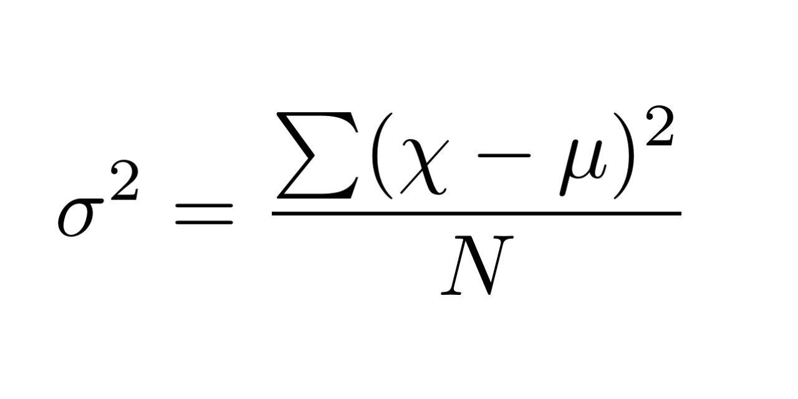

<div dir="rtl">

# جلسه سوم: حلقه در پایتون


  ## تمرین
  1. قطعه کدی بسازید که الگوی زیر را چاپ کند
  ```
*
**
***
****
*****
****
***
**
*
```

2. فرض کنید لیستی از نظرات سریال‌های Last of Us, House of The Dragon, The Rings of Power داریم. برنامه‌ای بنویسید که با بررسی آن‌ها تعداد نظرات هرکدام را مشخص و چاپ کند.
- Rings of Power
- House of The Dragon
- The Last of Us

  برای سادگی، کد زیر را توسعه دهید:
  
```python
comments=[
'This slow-burn episode of House of The Dragon is Game of Thrones as we know it – for better or worse.',
"The Last of Us is a worthy testament to the timeless game series that ensures that yes, the human spirit is unbreakable, even in the face of nature's harshest cruelties.",
"In The Lord of the Rings: The Two Towers, we are told that male and female dwarves are indistinguishable from one another due to their heavy facial hair. Well, a female dwarf appears in The Rings of Power – Sophia Nomvete’s Princess Disa – and she only has minimal facial hair. It’s very easy to distinguish her from the male dwarves.",

"The episode’s title, 'Second Of His Name,' refers to the fact that baby Aegon shares a name with Aegon the Conqueror, the legendary warrior who united the Seven Kingdoms under Targaryen rule. Considering most of House of The Dragon 's power players assume young Aegon will supplant his big sister as heir, the name is a portentous one.",
"As heartbreakingly faithful as it is riveting and suspenseful, The Last of Us is a triumph that ends any further debate about the all-time best video game adaptation.",
"Matt Smith plays Daemon as a vain and bitter man who nevertheless cannot quite betray his family name. He is a nasty piece of work, for sure, a misogynist and a sadist, but until episode six, he is the only truly despicable main player in King’s Landing. House of The Dragon takes its time to drip-feed the down-in-the-dirt baddies that are so enjoyable to rail against.",
"The Last of Us is a superb TV series which invests in its characters’ stories, their inner lives, and builds a complex relationship between its two leads.",
"whereas fewer people are complaining about House of The Dragon ’s adaptation of George RR Martin’s Fire and Blood. Still, Rings of Power has broken every Amazon viewership record there is, so it’s doing what it needs to do for them.",

]

last_of_us_count=0
rings_of_power_count=0
house_of_dragon_count=0

# You should mplement this
...

print(last_of_us_count)
print(rings_of_power_count)
print(house_of_dragon_count)


```

3. مثال محاسبه عدد اول جلسه سوم را طوری تغییر دهید که بهینگی خود را حفظ کند اما از break استفاده نکند.


## تمرین‌های پیشرفته
1. برنامه‌ای بنویسید که n عدد از کاربر بگیرد و میانگین و واریانس آن را حساب کند.



2. برنامه‌ای بنویسید که تعداد N عدد صحیح مثبت را خوانده و از بین آنها تعداد اعدادی که بر 5 بخشپذیر هستند را مشخص نماید.

3. برنامه‌ای بنویسید که دو رشته به عنوان ورودی بگیرد و چک کند که رشته اولی داخل رشته دومی موجود است یا نه.

  ## تحقیق
  1. لزوم استفاده از break و continue از منظر clean code
  2. مفهوم Refactor
  3. عملگرهای bitwise

  ## نحوه ارسال

  تمام الگوریتم‌ها باید مشابه دستخط آموزش داده شده در قالب یک فایل text به همراه نام و نام خانوادگی به تلگرام مدرس ارسال شود. تمرین‌های پیشرفته اختیاری است. همچنین دانش‌پذیران مهلت دارند تمرینات هر هفته را تا آخر روز سه‌شنبه هفته آتی ارسال نمایند. همچنین تحقیق‌ها به صورت یک فایل متنی جداگانه ارسال شود.

  نمونه فایل تمرین ارسالی:
  </div>

  ```python
  # excercise 1:
  1.
  2.
  3.

  # exercise 2:
  1.
  2.
    2_1.


  ```
